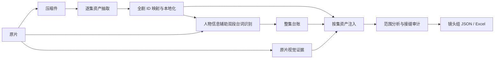
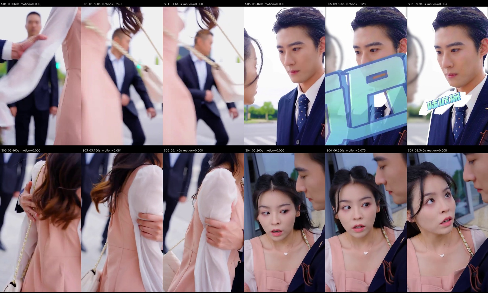
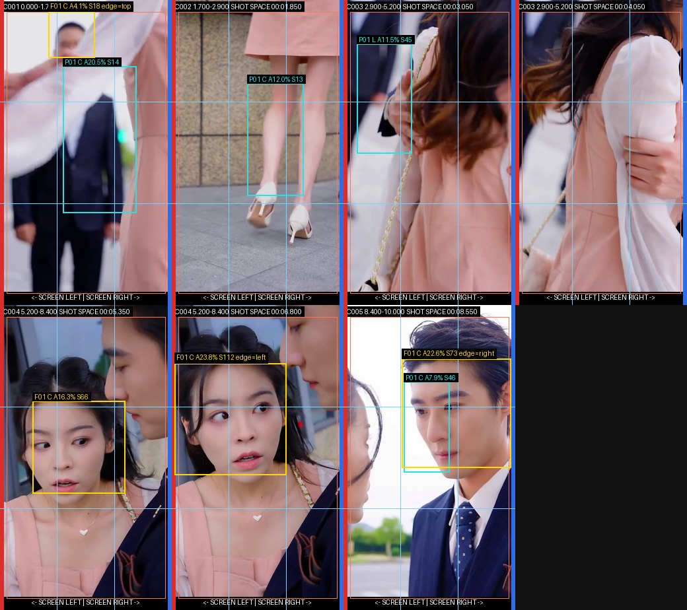
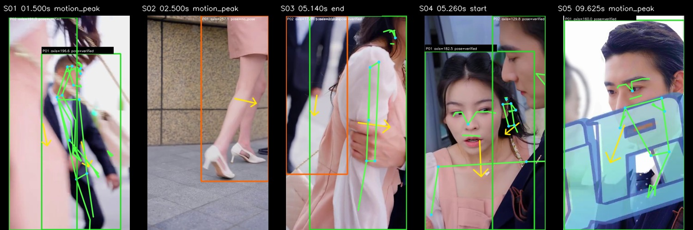

# 把短剧拆成能对账的镜头组

**一套面向短剧英式本地化制作的 Codex Skills。** 输入多集中文原片，整理出全剧资产、逐集台词和带连续性信息的镜头组，供后续角色图片与视频生成使用。这里最在意的不是“模型大致看懂了剧情”，而是交付出去的每个人名、每句台词、每次道具换手，都能回到原片和上游数据核对。

## 交付什么

- **资产表**：逐集抽取人物、场景、道具，合并跨集身份与故事状态，生成英式本地化的八列资产表；人物可继续生成 Face Bible 和角色图片提示词。
- **台词台账**：双段识别、重叠去重，保留原片绝对时间、说话人和演绎信息。
- **镜头组 JSON / Excel**：记录可见人物、动作、场景、台词和道具状态，并给相邻镜头组写状态交接。

这些材料分别对应 `全剧_英国本地化资产表.xlsx`、`EPxx/dialogue_ledger.json`、`shot_groups.expanded.json` 和逐集镜头组 Excel。角色图片与最终视频由下游工具生成。

## 核心技术方案

| 要解决的问题 | 当前做法 |
| --- | --- |
| 多集人物既要并发解析，又不能认错人 | 各集先用局部 ID 并发抽取，完成后统一映射全剧 ID；再用两轮提示词排除已识别人物，补捞漏掉的人。 |
| 模型容易补写台词、混用人物 | 按集注入资产卡，按时间注入已校验的台词台账；用源文件哈希挡住过期台词，接缝处再核对人物和道具状态。 |
| 原片太大，压缩后多人镜头看不清 | FFmpeg 双遍压缩，保留原片供本地取证；在文件大小限制下比较 24 fps 默认值与 20 fps 方案。 |
| 快切镜头留不住动作细节 | 按时间范围分析原片，制作边界帧、动作帧、运动三联帧和人物轨迹证据，再合并与审计镜头组。 |

## 用到的库与模型

| 环节 | 选用的工具 | 在这里做什么 |
| --- | --- | --- |
| 视频准备与切分 | FFmpeg / FFprobe | 压缩、探测时长、计算候选切点、裁出带重叠上下文的分析片段。 |
| 本地视觉证据 | OpenCV、NumPy、Pillow；OpenCV 内置 Haar / HOG | 抽帧、帧差与光流、人物和人脸候选、空间几何，再把证据排成图页。 |
| 本地人物与姿态 | Ultralytics YOLO11n（默认 `yolo11n.pt`）+ BoT-SORT；MediaPipe Pose Lite | 检测并跟踪镜头内的人，挑选动作帧和姿态关键点。YOLO 经 Ultralytics 间接使用 PyTorch；仓库没有训练代码，也不附 YOLO 权重。 |
| 语义解析与表格 | 中转站（默认模型 ID `gemini-3.6-flash`）、`requests`；`openpyxl`、Node `@oai/artifact-tool` | 通过外部服务解析人物、台词与镜头语义；本地读取资产表、导出结果。 |

JointBDOE-S 是可选的外部多人姿态方案：仓库有结果融合脚本，但未打包权重和完整推理入口，默认流程不能直接启用。[视觉方案与代码对应表](docs/VISION_PIPELINE.md)

## 从原片到交付物



### 案例：10 秒竖屏片段的证据图

下面是同一段国产竖屏短剧测试片段的**实际证据页**，不是绘制的示意图。镜头里先是手臂被抓住，再是高跟鞋迈步，最后切向双人近景。只看几张均匀抽取的帧，很容易漏掉动作发生的瞬间；这套图把时间、动作和人物位置分开呈现，供镜头组分析回看原片。这里展示的是本地视觉证据，不是台词解析或最终镜头组结果。

**动作在哪里变化？** 高运动三联帧保留峰值前、中、后画面；[范围首尾帧](docs/assets/case-study/page_01_range_edges.jpg)和[动作关键帧](docs/assets/case-study/page_02_event_keyframes.jpg)可对照检查时间边界。



**人物站在哪里、怎么接上下一镜？** 镜头空间页标出人脸与人体候选、画面边缘及相对位置；[人物轨迹页](docs/assets/case-study/page_05_person_trajectory.jpg)补充镜头内移动路径，轨迹编号在切点处重置，不能当作跨镜身份。



**多人姿态能否提供辅助线索？** 可选的 JointBDOE 与 MediaPipe 融合页把候选框和已验证的姿态骨架区分显示；它只辅助判断身体几何，不替代原片里的身份、视线和动作判断。



[视觉证据的逐页实现](docs/VISION_PIPELINE.md)说明了每一步用了什么库。原视频未随仓库打包。

### 解析能细到哪里

最细不是一段剧情概括，而是**子镜头里的每个人、每件关键道具，以及每句连续发声**。证据可以定位到具体时间点，但流程没有逐帧给整段视频打标签。

| 维度 | 最细记录 |
| --- | --- |
| 人物身份与状态 | 单集 ID 映射全剧 ID；区分人物本体与服装、伤情等持续状态。 |
| 人物外观 | 脸型、五官、发际线、发型、体态、衣着层次和可辨认配饰。 |
| 场景 | 空间本体及持续变化；出入口、区域、固定陈设与光源。 |
| 道具 | 同一实物的实例 ID、持有者、手／身体／表面接触、开合状态，以及交接前／中／后。 |
| 台词 | 一句连续发声的起止时间、说话人、原话、语速、音色、情绪、语调和句内停顿；跨切镜保持同一句。 |
| 切镜与机位 | 候选切点、子镜头时间、景别、角度、机位与画面运动。 |
| 可见人物 | 每个子镜头中的人物，包括未匹配资产的路人、画面边缘的局部人物和虚焦人物；记录遮挡、裁切、前后景与清晰度。 |
| 空间关系 | 开始／中间／结束三个时间锚点的左右顺序；人物两两之间的前后、遮挡、朝向和穿行路径。 |
| 微动作与视线 | 每个人的姿态、支点、手部接触、视线目标、表情与嘴部变化；嘴部动作和台词归属分别核对。 |
| 画面与声音 | 构图、景深、焦点变化、昼夜依据、可读文字、环境声及画外台词。 |
| 跨组连续性 | 每组首尾的人物、动作和道具状态；相邻组判断继承状态、切换场景或回原片核实。 |

这些字段的判断边界见[镜头组解析规则](skills/adaptive-evidence-clipped-shot-groups/references/analysis-rules.md)和[输出结构](skills/adaptive-evidence-clipped-shot-groups/references/output-schema.md)。例如“嘴张了”不等于“这个人在说话”；左右换位也要区分人物真的穿行，还是切镜后重新站位。

一集原片只有一两分钟，难的是把多集内容接起来：同一个人不能换个名字，台词不能被模型改写，镜头里的动作也不能只剩一句剧情概括。上面几种做法，都是在处理这些问题时逐步加进来的。

## 制作中遇到的四个问题

### 名字稳了，为什么还要放弃串行？

初版把第一集的人物结果注入第二集提示词，跨集命名容易保持一致，整剧却必须排队解析。现在各集并发生成 `EP01_CHAR_001` 这样的局部 ID，全集完成后再映射到 `CHAR_001` 等全局 ID；换装和受伤状态归属同一人物本体。并发之后漏人变多，于是主解析后再做两轮人物补漏：把已找到的人名注入提示词，让模型专找剩下的说话人和独立行动者，再按名字、别名排重。项目当时测试的人物覆盖约 **95%**；仓库尚无公开标注集，这不是通用基准。[实现](skills/bai-video-chinese-assets/SKILL.md)

### 几百兆压到 10 MB，为什么多人镜头反而糊？

一两分钟的原片要适应模型传输限制。在相近时长和文件大小下，信息密集的多人镜头比单人镜头更容易丢细节。60 fps 素材试降到 20 fps 后，有限码率能更多分给每帧；代价是眼神、嘴部和快切的时间细节可能减少。压缩脚本采用 FFmpeg 双遍码率控制，默认 **24 fps**，`--fps 20` 是可比较的实验选项。为保留本地视觉证据所需的原片，压缩时使用 `--keep-source`。[实现](skills/video-compress-for-bai/SKILL.md)

### 模型看过视频，为什么还要“注入”？

测试复杂任务时，模型容易按剧情补人、改台词，或者忘记前一镜的状态。注入把注意力收回到这次判断需要的材料：台词识别拿人物名、别名和服装态；镜头分析按集号拿**全部人物、场景、道具卡**，但只绑定原片实际看到的资产；台词从校验后的整集台账按时间取，`source_ledger.sha256` 不一致就拒绝旧注入；接缝审计拿左侧状态作线索，仍用右侧视频核实。两轮人物补漏则反过来注入“已经找到了谁”。[台词注入](skills/adaptive-evidence-clipped-shot-groups/scripts/build_dialogue_injection.py) · [接缝注入](skills/adaptive-evidence-clipped-shot-groups/scripts/build_seam_continuity_injection.py)

### 一秒两三次切镜，眼神和道具交接怎么留住？

当时的 Seedance 2.0 工作流按单段不超过 15 秒准备下游生成，但镜头组不能只靠时长硬切。分析先规划约 8–10 秒的逻辑范围、保留重叠上下文，再从**原片**抽取边界、动作关键帧、高运动三联帧、镜头空间和人物轨迹。第一轮并发分析，第二轮查接缝；只有实质矛盾才定向重跑。定稿后台词只分配一次，相邻镜头组要接上人物与道具状态。[主流程](skills/adaptive-evidence-clipped-shot-groups/SKILL.md)

## 如何检查这个仓库

没有私有剧集和模型凭据，也可以运行几项本地契约测试：

```bash
python3 -m compileall -q skills
python3 skills/align-episode-dialogue-two-segment/scripts/test_two_segment_contract.py
python3 skills/adaptive-evidence-clipped-shot-groups/scripts/test_adaptive_range_planner.py
node skills/adaptive-evidence-clipped-shot-groups/scripts/test_shot_content_contract.mjs
```

完整运行的依赖和输入见[安装说明](docs/SETUP.md)，设计细节见[架构说明](docs/ARCHITECTURE.md)。仓库包含 **8 个 Skill 和 1 个轨迹脚本依赖**。当前没有随仓库公开的原剧样本、标注集或端到端质量基准；完整流程需要项目素材、中转站/TOS 授权及相应 runtime。脚本中的 `BAI_*` 配置名、`bai_` 文件名和默认接口地址为历史兼容项；更换中转站需验证接口与模型 ID。JointBDOE 可选姿态路径的权重和完整推理入口也未打包。目前未附开源许可证。
