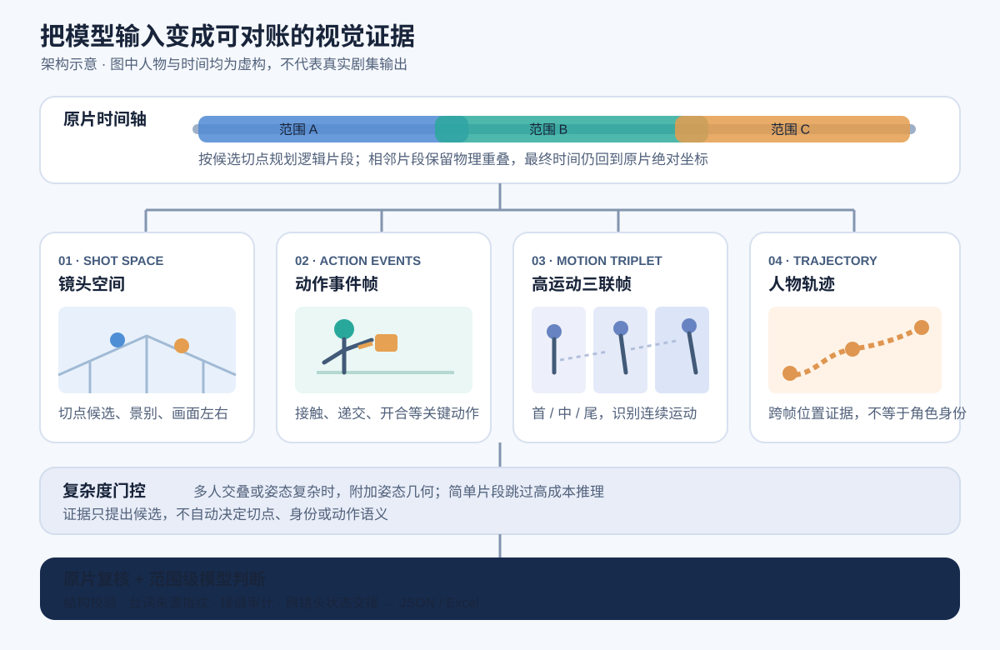

# 方案与取舍

## 这套方案是怎么迭代出来的

最早为保持跨集人物命名，采用串行解析：第一集结果进入第二集提示词。它减少了名字漂移，却让整剧等待时间随集数累积。现在逐集独立生成 `EPxx_CHAR_xxx` 等局部 ID，完成后再用完整语义描述映射到全剧 ID；人物本体和服装、伤病等状态分别保留。并发后的漏人问题用两轮同集审计补救：每轮注入已识别人物，专找其余说话人和独立行动者。项目当时的测试观察约有 95% 的人物覆盖，但仓库没有公开标注集，不能将其视为通用基准。

原剧常是一两分钟、几百兆，而模型传输压缩件的目标是 10 MB 以内。在固定大小下，多人物画面比单人画面更容易失去可辨细节。把 60 fps 源素材试降到 20 fps，可以把有限码率更多留给每帧；代价是快速动作的时间采样变疏，所以本地视觉证据优先从原片生成。压缩脚本目前默认 24 fps，20 fps 是可配置的实验值，保留原片需传 `--keep-source`。

复杂任务里的另一类错误来自模型注意力：它可能补出未见人物、改写台词，或把前段状态当作后段事实。人物补漏、台词锁定、按集资产卡和接缝状态都采用注入，但每类注入都明确来源与约束；模型仍需回看视频，只有直接观察到的资产才能绑定输出。

一秒两三次切镜时，短促眼神和嘴部变化无法只凭稀疏静帧交付。方案把约 8–10 秒的逻辑分析范围与当时 Seedance 2.0 流程中单段不超过 15 秒的生成目标分开，范围附重叠上下文和多类证据页，最后再按剧情、动作和台词组织镜头组。

## 证据的权威顺序

原视频是最终事实来源；镜头边界检测、动作帧、空间几何和 BoT-SORT 轨迹只产生候选证据；模型据原片和证据包判断人物、动作、切点及空间关系。程序校验时间、结构、来源指纹和唯一性，但不偷偷改写语义。这样把“不确定”显式留给审计，而不是包装成确定答案。详见 [分析规则](../skills/adaptive-evidence-clipped-shot-groups/references/analysis-rules.md)。

## 为什么是两波处理

第一波并发分析独立范围，控制长视频请求的失败半径；第二波审计相邻范围的接缝，只在发现实质矛盾时重跑右侧范围。范围工作区和命令状态都绑定源视频、台词版本及参数指纹，恢复时不能捡用别的项目或旧版本结果。跨 Codex 窗口的 中转站 key 槽位由 SQLite 租约协调。见 [批量执行](../skills/adaptive-evidence-clipped-shot-groups/references/batch-execution.md)。

## 为什么先锁台词与资产

台词先按全集合并、去重和校验，再以同一台账指纹注入所有范围；最终镜头组对每条事件做唯一分段，避免跨组重复。中文资产保留源名与本地化名的双向映射，让视觉识别证据与下游生成名称可以对账。见 [台账结构](../skills/align-episode-dialogue-two-segment/references/dialogue-ledger-schema.md)。

## 为什么状态需要交接

道具的实例、持有者、接触、开合和可见状态会跨镜头持续；人物装束、伤痕、遮挡也是如此。合并完镜头组后，每对相邻组生成一条 `inherit_state`、`new_scene` 或 `verify` 交接。没有看到移除或转移，就不能假定状态消失；证据不足则明确待核验。统一 composer 再将这些内容写入 Excel，并检查格式契约。见 [输出结构](../skills/adaptive-evidence-clipped-shot-groups/references/output-schema.md)。

## 适用边界

这是针对短剧资产生产设计的实际工作流，并非零配置产品。部分字段与 中转站/TOS、项目工作簿、Codex `@oai/artifact-tool` 环境绑定；姿态增强依赖额外模型，JointBDOE 用于生产前须确认许可。仓库没有公开剧集及端到端基准数据，脚本测试通过不代表新项目的内容质量已验证。
